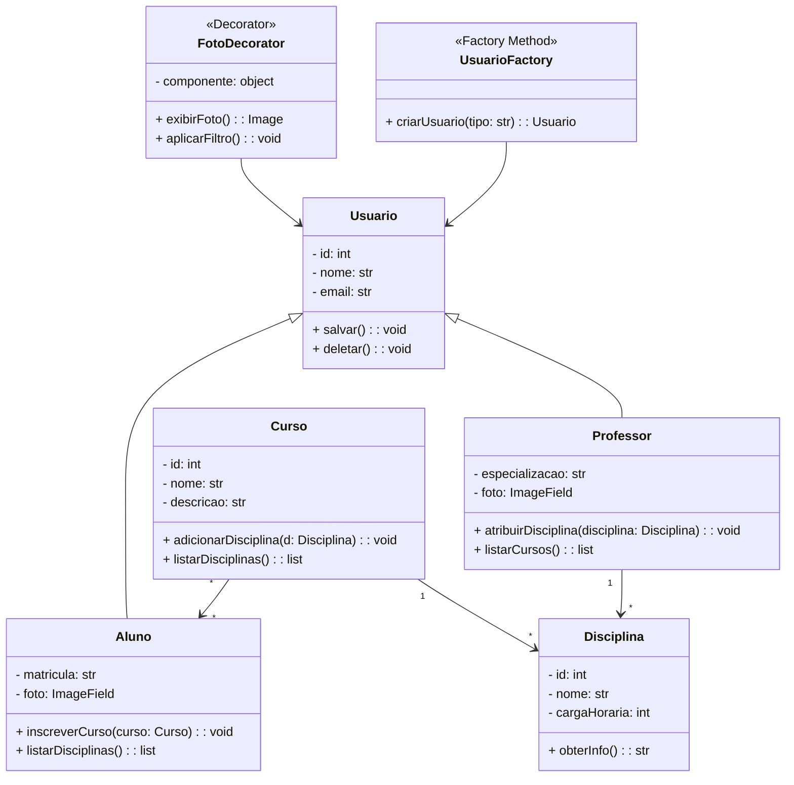

# Diagrama de classe

```mermaid

classDiagram
    class Usuario {
        - id: int
        - nome: str
        - email: str
        + salvar(): void
        + deletar(): void
    }

    class Aluno {
        - matricula: str
        - foto: ImageField
        + inscreverCurso(curso: Curso): void
        + listarDisciplinas(): list
    }

    class Professor {
        - especializacao: str
        - foto: ImageField
        + atribuirDisciplina(disciplina: Disciplina): void
        + listarCursos(): list
    }

    class Curso {
        - id: int
        - nome: str
        - descricao: str
        + adicionarDisciplina(d: Disciplina): void
        + listarDisciplinas(): list
    }

    class Disciplina {
        - id: int
        - nome: str
        - cargaHoraria: int
        + obterInfo(): str
    }

    class FotoDecorator {
        <<Decorator>>
        - componente: object
        + exibirFoto(): Image
        + aplicarFiltro(): void
    }

    class UsuarioFactory {
        <<Factory Method>>
        + criarUsuario(tipo: str): Usuario
    }

    %% Heranças e associações
    Usuario <|-- Aluno
    Usuario <|-- Professor
    Curso "1" --> "*" Disciplina
    Curso "*" --> "*" Aluno
    Professor "1" --> "*" Disciplina
    FotoDecorator --> Usuario
    UsuarioFactory --> Usuario
```